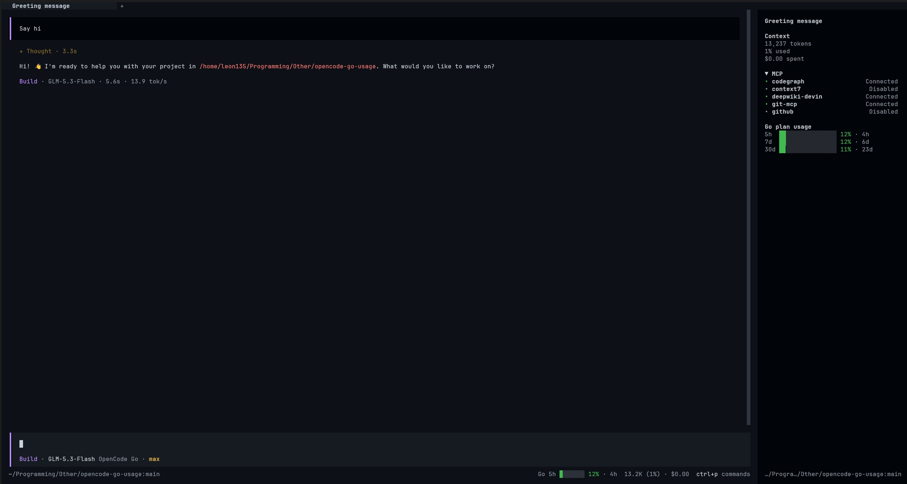

# @leon135/opencode-go-usage

[](https://www.npmjs.com/package/@leon135/opencode-go-usage)
[](https://opensource.org/licenses/MIT)

OpenCode V2 TUI plugin showing [opencode-go](https://opencode.ai/zen) (Zen) usage limits in the sidebar and prompt footer.

Based on work of [davidaayers](https://github.com/davidaayers/opencode-go-usage-plugin), ported and improved for OpenCode V2.



## Features

- **Three usage windows** - 5-hour rolling, weekly, and monthly limits with reset countdowns
- **Color-coded gauges** - green when healthy, warning at ≥75%, danger at ≥90%
- **Sidebar widget** - a "Go plan usage" panel with block gauges and time-to-reset
- **Prompt footer gauge** - compact usage readout next to your current model
- **Theme-aware** - colors adapt to your OpenCode theme
- **Live updates** - polls the Zen usage API every 60 seconds, plus instant refreshes on session events

## Requirements

- [OpenCode V2](https://opencode.ai/v2/docs/)
- An [opencode-go (Zen)](https://opencode.ai/zen) plan, authenticated with `opencode auth login` - the plugin reads the key from OpenCode's local credential store

## Install

Add the package to `plugins` in your `opencode.json(c)`:

```jsonc
{
  "$schema": "https://opencode.ai/config.json",
  "plugins": ["@leon135/opencode-go-usage"]
}
```

OpenCode installs and loads the plugin automatically on the next start.

## Usage

Once installed, restart OpenCode. With an authenticated Zen plan you'll see:

- **Sidebar** - a "Go plan usage" panel listing the 5h / 7d / 30d windows, each with a gauge, percentage used, and time until reset
- **Footer** - a compact gauge (e.g. `Go 5h ▍ 12% · 4h`) next to the current model

Gauge colors follow your remaining quota: normal → **warning** at ≥75% → **danger** at ≥90%.

If no Zen credentials are found, the widget stays hidden until you sign in with `opencode auth login`.

## License

MIT

---

**Built with 💜 by [Leon135](https://leon135.xyz)**
